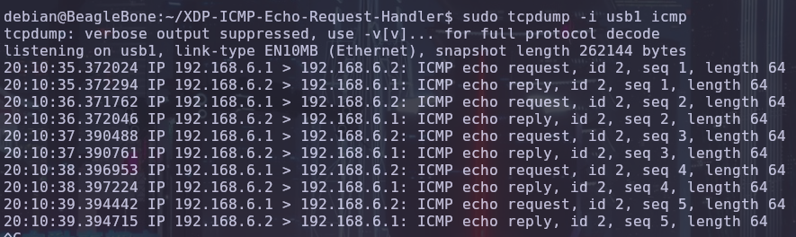

---

\newgeometry{top=3cm}
# Introducción
Vamos a usar XDP_TX para implementar un servidor de eco ICMP/ICMPv6 en una Beagle Bone Black (BBB).

El servidor recibirá un paquete ICMP o ICMPv6, intercambiará las direcciones MAC de destino y origen, las direcciones IP/IPv6, cambiará el campo Type para que sea Response y cambiará el checksum para que sea correcto después de estas modificaciones.


# Instalación debian y patch rt

Descargamos [Debian 11 para la BBB](https://forum.beagleboard.org/t/debian-11-x-bullseye-monthly-snapshot-2023-10-07/31280)

Instalamos patch rt mediante el comando:
```bash
sudo apt install bbb.io-kernel-5.10-ti-rt-am335x
```
Reiniciamos el sistema para que los cambios surtan efecto.

# Configuración de red (uso de usb para red)

Para conectar la BBB a internet y al portátil hemos usado el cable de USB, no hemos usado los cables Ethernet. Hemos configurado el portátil para que haga forwarding de paquetes y usando iptables hemos puesto reglas para que funcione como un router para la BBB. Hemos configurado la BBB para que usara el portátil como gateway y le hemos agregado una dirección para uso de DNS. Esto ha servido para facilitar instalar utilidades en la BBB cómodamente, trabajar con git y comprobar que teníamos conexión con el exterior. 
Para IPv6 le hemos dado una dirección global a la BBB y la hemos configurado para que la salida por defecto sea la interfaz conectada por USB.
Todas estas configuraciones están recogidas en dos scripts (disponibles en el repositorio), puesto que son volátiles y se eliminan al apagar los sistemas.


# Explicación del funcionamiento del código
IPv4:
Primero nos aseguramos que sea un paquete no vacío ni bugeado al comprobar que su inicio + 1 no es mayor al final del paquete, posteriormente gracias a las variables de xdp cambiamos las direcciones MAC en la capa de Ethernet. Comprobamos de nuevo lo mismo que al inicio para poder proseguir con la capa IP donde veremos si es un paquete ICMP, en caso afirmativo se le asignará un nuevo ttl y este dato junto al ttl anterior lo usaremos para poder calcular el checksum, el cual almacenaremos en otra variable de XDP y solo entonces haremos un PASS para poder devolver exitosamente nuestro reply creado en XDP.

IPv6:
Hacemos básicamente lo mismo pero con una serie de datos establecidos por nosotros en forma de estructura privada, esto con el fin de definir una estructura ICMPv6 sin entrar en conflicto con las macros del sistema. El proceso en este caso es el mismo pero usando esta estructura, posteriormente en el caso de que sea un paquete ICMPv6, calculamos el checksum con diferencias de TTL y restando 23 (que es 17 en hexadecimal) con el fin de hacer que el checksum sea correcto. Ya que en nuestras pruebas tenía ese desfase.

# Explicación de las pruebas (tcpdump, wireshark)

Para probar el funcionamiento durante el desarrollo y con el programa final se han utilizado las herramientas de captura de paquetes tcpdump y Wireshark (que trabaja sobre tcpdump). 
tcpdump se ejecuta en el espacio de usuario y utiliza libpcap (Packet Capture Library), que es una biblioteca de espacio de usuario que usa PF_PACKET.
PF_PACKET es un tipo de familia de socket en Linux que permite interactuar directamente con las tramas de red en la capa de enlace de datos.. Permite capturar paquetes directamente desde una interfaz de red antes de que sean procesados por las capas superiores del stack de red.
Como XDP funciona por debajo de la pila de red del sistema operativo, si se captura con tcpdump en un equipo con un filtro XDP, los paquetes filtrados por XDP no aparecerán en la captura de tcpdump. 
De esta forma, si en un equipo (BBB) se carga el servidor eco y se captura con tcpdump y en otro equipo (portátil) se captura con tcpdump y se hace un ping al primero, en el primer equipo no se capturar´a ningún paquete ICMP y en el segundo se verá el tráfico de solicitudes y respuestas como si no hubiese ningún programa XDP. 
Así es fácil reconocer errores de en la forma de parseo y filtrado con XDP, porque los paquetes mal filtrados serán capturados por tcpdump en la BBB, y errores de manipulación de direcciones, TTL, checksum, etc porque serán capturados por el portátil. Utilizamos Wireshark en el portátil porque trabaja sobre tcpdump y tiene una interfaz más amigable.

```bash
sudo tcpdump -i nombre_interfaz icmp
```

# Imágenes

## Wireshark sin xdp

<br>

## Tcpdump con xdp

<br>

## Wireshark con xdp

<br>

## Tcpdump con xdp

<br>

# Conclusión
Trabajar con este proyecto nos ha permitido ver cómo XDP puede ser una herramienta poderosa para personalizar el comportamiento de la red en el kernel, y cómo hacerlo requiere un profundo entendimiento de las capas de red y las estructuras de datos en C. Esto nos ha enseñado cómo podría aplicarse XDP en otros contextos, como la seguridad o el monitoreo de redes.

# README
## XDP ICMP Echo Request Handler
Este programa utiliza XDP (eBPF) para interceptar y modificar paquetes de red ICMP y ICMPv6. Su objetivo es interceptar solicitudes de eco ICMP (ping) y ICMPv6, intercambiando las direcciones de origen y destino, y modificando el tipo del mensaje a la respuesta de eco correspondiente.

## Funcionalidad
- **Intercambio de direcciones MAC**: Cambia las direcciones MAC de origen y destino en los paquetes Ethernet.
- **ICMP sobre IPv4**: Si el paquete es una solicitud de eco ICMP (Echo Request), intercambia las direcciones IP de origen y destino, cambia el tipo a Echo Reply y actualiza el checksum del paquete.
- **ICMP sobre IPv6**: Si el paquete es una solicitud de eco ICMPv6 (Echo Request), intercambia las direcciones IP de origen y destino, cambia el tipo a Echo Reply y actualiza el checksum del paquete.

## ¿Cómo funciona?
1. **XDP**: El programa se carga y ejecuta en el contexto de un XDP program, que es un tipo de programa eBPF que se ejecuta en la capa más baja de la pila de red, directamente en la interfaz de red.

2. **Procesamiento de paquetes**:
- Cuando un paquete ICMPv4 o ICMPv6 llega a la interfaz de red, el programa:
    1. Verifica si el paquete es ICMPv4 o ICMPv6.
    2. Si es una solicitud de eco (Echo Request), intercambia las direcciones de origen y destino.
    3. Modifica el tipo de ICMP a Echo Reply (respuesta de eco).
    4. Actualiza el checksum de ICMP (tanto para IPv4 como para IPv6) para reflejar el cambio de tipo de mensaje.

3. **Respuesta al paquete**: El programa luego reenvía el paquete con los cambios realizados.

## Requisitos
- **Kernel**: 4.8 o superior.
- **Herramientas**: `clang`, `xdp`.

## Dependencias
```bash
sudo apt install clang llvm libelf-dev libbpf-dev libpcap-dev build-essential
sudo apt install linux-headers-$(uname -r)
```

Debian:
```bash
sudo apt install linux-perf
```

Ubuntu:
```bash
sudo apt install linux-tools-$(uname -r)
```

## Problemas
/usr/include/linux/types.h:5:10: fatal error: 'asm/types.h' file not found **

Encuentra donde está el archivo .h, podría no estar en /usr/include

```bash
find /usr/include/ -name types.h | grep asm
```
Haz un softlink entre los headers y donde la librería espera que estén:
```bash
sudo ln -s /usr/include/x86_64-linux-gnu/asm /usr/include/asm
```
Este problema puede ocurrir con otros headers requeridos dependiendo de la distribución de linux. Las soluciones proporcionadas arriba funcionan con cualquier otro header.

## Uso
1. **Compilación**:
```bash
clang -O2 -target bpf -c echo_server.c -o echo_server.o
```

2. **Carga del programa**:
```bash
sudo ip link set dev <interface> xdp obj echo_server.o sec xdp
```

3. **Descarga del programa**:
```bash
sudo ip link set dev <interface> xdp off
```
